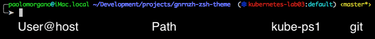

# gnrnzh-zsh-theme
Customization of gnzh.zsh-theme from oh-my-zsh. 


## Installing
First download the theme:

using wget:
```
wget https://raw.githubusercontent.com/PaoloneM/gnrnzh-zsh-theme/master/gnrnzh.zsh-theme \
  -O ~/.oh-my-zsh/themes/gnrnzh.zsh-theme
```

using curl:
```
curl https://raw.githubusercontent.com/PaoloneM/gnrnzh-zsh-theme/master/gnrnzh.zsh-theme \
  -o ~/.oh-my-zsh/themes/gnrnzh.zsh-theme
```

then simply select it in your `~/.zshrc file`:
```
ZSH_THEME="gnrnzh"
```

## Changes from original theme

### v0.0.1 
Adds kube-ps1 info in path 

## License
Gnrnzh zsh theme is released under the [MIT license](LICENSE.txt).

## Credits
Thanks to [@macno](https://github.com/macno) for inspiring theme name!
